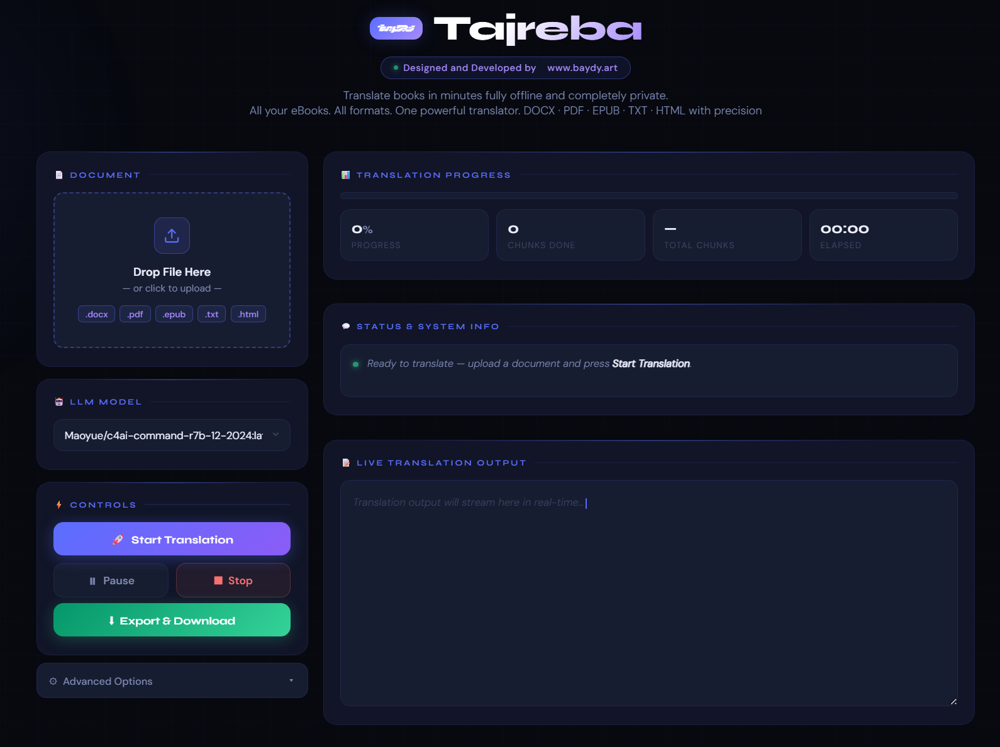

# <p align="center"><br>Tajreba | تجربة</p>

<p align="center">
  <b>Local-First AI Book & Document Translator</b><br>
  English ↔ Arabic<br>
  Powered by <a href="https://ollama.ai">Ollama</a> & <a href="https://flask.palletsprojects.com/">Flask</a>
</p>

<p align="center">
  <a href="https://github.com/ayoubaydy/Tajreba/issues"></a>
  <a href="https://github.com/ayoubaydy/Tajreba/stars"></a>
  <br>
  <a href="https://www.baydy.art"></a>
</p>

<p align="center">
  <a href="#english"><b>English</b></a> &nbsp; | &nbsp; <a href="#العربية"><b>العربية</b></a>
</p>

<p align="center">
  
</p>

---

<h2 id="english">English</h2>

**Tajreba** is a professional **book and document translation tool** powered by **local large language models (LLMs)** through [Ollama](https://ollama.ai).  
It enables accurate, refined English-to-Arabic translation for books, e-books, and documents — **securely, privately, and offline**.

### 🌍 Inspiration

The idea for **Tajreba** was born from the widening gap in **modern Arabic translations**. Many of today’s **scientific, literary, and cultural works** from the West either never reach Arabic readers or take years to do so — often due to **publishing restrictions**, **licensing barriers**, or **limited translation initiatives** across the Arab world.

**Tajreba** was created to help **bridge that gap**, giving individuals, researchers, and readers direct access to global knowledge in their native language — **freely, locally, and instantly**.

### 🎥 Watch Tajreba in Action

Check out our official YouTube channel for demos, updates, and translation showcases:  
▶️ [@Tajrebah on YouTube](https://www.youtube.com/@Tajrebah)

[](https://www.youtube.com/watch?v=QH7MKsal4vQ)


### ✨ Features

- **Multi-Format Input** — Translate DOCX, PDF, EPUB, TXT, and HTML files seamlessly.
- **Local Translation Engine** — Uses Ollama-based local LLMs for private, cost-free translation.
- **Real-Time Progress** — Streamed translation with live updates and chunk-by-chunk output.
- **Customizable Prompts** — Adjust tone, precision, and translation style through editable prompts.
- **Modern Interface** — Built with Flask and a custom HTML/CSS UI; features dark mode, live preview, and progress tracking.
- **DOCX Export** — Save your Arabic translation in a polished, editable Word document.

### ⚙️ How It Works

1. **Download Ollama**  
   Install [Ollama](https://ollama.ai) to run language models locally on your machine.

2. **Choose Your Arabic Model**  
   We recommend using **`CohereLabs/c4ai-command-r7b`** for high-quality and up-to-date Arabic translations.

3. **Translate Your Book or Document**  
   Import your English e-book or document into **Tajreba**, select your preferred **LLM model**, and start the translation process.  
   Watch as your text is **translated live** into polished, publication-ready Arabic — fully offline.

### 🚀 Getting Started

#### Requirements
- Python 3.8 or higher
- [Ollama](https://ollama.ai) installed locally
- (Optional) Additional parsers for enhanced file handling.

#### Installation
```bash
git clone https://github.com/ayoubaydy/tajreba.git
cd tajreba
python -m venv .venv
# On Windows:
.venv\Scripts\activate
# On macOS/Linux:
source .venv/bin/activate

pip install -r requirements.txt
# Install additional dependencies
pip install flask beautifulsoup4 pymupdf ebooklib
```

#### Run the Translator
```bash
python run.py
```

Then open your browser and visit:  
**http://127.0.0.1:5000**

---

<div dir="rtl">

<h2 id="العربية">العربية</h2>

**تجربة** هي أداة احترافية لترجمة **الكتب والمستندات**، تعمل بالاعتماد على **نماذج اللغة الكبيرة المحلية (LLMs)** من خلال [Ollama](https://ollama.ai).  
تمكّنك من الحصول على ترجمة دقيقة ومصقولة من الإنجليزية إلى العربية للكتب، الكتب الإلكترونية، والمستندات — **بشكل آمن، خاص، ومن دون اتصال بالإنترنت**.

### 🌍 الإلهام

جاءت فكرة **تجربة** من الفجوة المتزايدة في **الترجمات العربية الحديثة**.  
فالعديد من **الأعمال العلمية والأدبية والثقافية** الغربية لا تصل إلى القارئ العربي، أو تصل بعد سنوات طويلة — وغالبًا بسبب **قيود النشر**، أو **العقبات القانونية**، أو **قلة المبادرات** في مجال الترجمة على مستوى العالم العربي.

تهدف **تجربة** إلى **سدّ هذه الفجوة**، وتمكين الأفراد والباحثين والقراء من الوصول إلى المعرفة العالمية بلغتهم الأم — **بشكل حر، محلي، وفوري**.

### 🎥 شاهد تجربة أثناء العمل

تابع القناة الرسمية على يوتيوب للاطلاع على العروض التوضيحية والتحديثات ونماذج الترجمة:  
▶️ [@Tajrebah على يوتيوب](https://www.youtube.com/@Tajrebah)

[](http://www.youtube.com/watch?v=QH7MKsal4vQ)

### ✨ المميزات

* **دعم تنسيقات متعددة** — ترجمة ملفات DOCX وPDF وEPUB وTXT وHTML بسهولة.
* **محرك ترجمة محلي** — يعتمد على نماذج Ollama المحلية لضمان الخصوصية والتشغيل دون تكلفة.
* **تقدم لحظي** — عرض مباشر للترجمة مع تحديث حي ومخرجات جزئية أثناء العمل.
* **أوامر قابلة للتخصيص** — يمكنك تعديل أسلوب الترجمة ودقتها ونبرتها حسب رغبتك.
* **واجهة حديثة** — مبنية باستخدام Flask، مع الوضع الليلي ومعاينة مباشرة ومتابعة للتقدم.
* **تصدير إلى DOCX** — حفظ الترجمة العربية في ملف وورد منسّق وقابل للتعديل.

### ⚙️ كيف تعمل

1. **تثبيت Ollama**  
   قم بتثبيت [Ollama](https://ollama.ai) لتشغيل نماذج اللغة على جهازك محليًا.

2. **اختر النموذج العربي المفضل لديك**  
   نوصي باستخدام النموذج **`CohereLabs/c4ai-command-r7b`** لجودة عالية وترجمة عربية دقيقة.

3. **ترجم كتابك أو مستندك**  
   استورد ملفك الإنجليزي (كتاب أو مستند) إلى **تجربة**، واختر النموذج اللغوي المناسب، ثم ابدأ عملية الترجمة.  
   شاهد كيف يُترجم النص أمامك **بشكل مباشر** إلى عربية مصقولة وجاهزة للنشر — وكل ذلك **دون اتصال بالإنترنت**.

### 🚀 البدء بالاستخدام

#### المتطلبات
* Python 3.8 أو أحدث
* تثبيت [Ollama](https://ollama.ai) محليًا
* (اختياري) حزم إضافية لتحسين معالجة الملفات.

#### التثبيت
```bash
git clone https://github.com/ayoubaydy/tajreba.git
cd tajreba
python -m venv .venv
# في ويندوز:
.venv\Scripts\activate
# في ماك/لينكس:
source .venv/bin/activate

pip install -r requirements.txt
pip install flask beautifulsoup4 pymupdf ebooklib
```

#### تشغيل التطبيق
```bash
python run.py
```

ثم افتح المتصفح وانتقل إلى:  
**http://127.0.0.1:5000**

</div>

---

<div align="center">

### 🌐 Connect & Community

**Website**: [www.baydy.art](https://www.baydy.art) &nbsp;•&nbsp;
**YouTube**: [@Tajrebah](https://www.youtube.com/@Tajrebah) &nbsp;•&nbsp;
**LinkedIn**: [Ayoub Baydy](https://www.linkedin.com/in/ayoubaydy/)

<br>

<sub>
**Keywords**: Local LLM Translator, English to Arabic AI, Offline Translation, Ollama Web UI, Flask Translator, Arabic Book Translation, E-book Translator, Document Localization, Python, Open Source.
</sub>

</div>

---

<p align="center">
  Tajreba — Translating knowledge, preserving meaning. Locally.<br>
  <br>
  Designed & Developed by <a href="https://www.baydy.art"><strong>Baydy Art</strong></a>
  <br>
  <a href="https://www.baydy.art"></a>
</p>